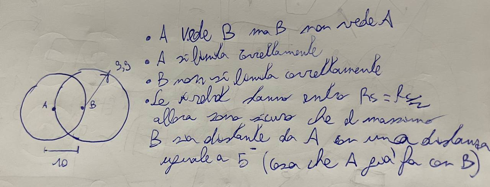

# DISTRIBUTE_ESTIMATION_PROJECT
This repository contains the code developed by Edoardo Castioni and Massimiliano Pranzo for the project of the "Intelligent distributed system" of professor Fontanelli.
The project consist in the distributed encirclement of a moving target (person, wheeled robot, ...) via a set of agents that can interact with each other in a confined range. The main problem is to dispose the agents in a predefined (or not) formation and equally spaced. This requirements need the design of two different controller:
  - One for the formation control: this controller exploits the Voroni tasselation in order to consider a confined range of communication and avoid possible obstacles.
  - One for the euqally spacing control: this controller has to be designed via a curviliear abscissa avoiding as much as possible agents "overtakeing"
   

# Papers and related works.
## General papers
- [_Distributed Optimal Deployment on a Circle for
Cooperative Encirclement of Autonomous
Mobile Multi-Agents_](https://ieeexplore.ieee.org/stamp/stamp.jsp?tp=&arnumber=9044350)
- [_Distributed encirclement control of multi-agent
systems_](https://ieeexplore.ieee.org/stamp/stamp.jsp?tp=&arnumber=7231770)
- [_Distributed Kalman Filters for Relative
Formation Control of Multi-agent systems_](https://arxiv.org/pdf/2110.06332.pdf)
- [_Proportional-Integral Formation Control for Multi-Agent Systems with
Time-Varying Attitudes under Relative Measurements_](https://ieeexplore.ieee.org/stamp/stamp.jsp?tp=&arnumber=8899676)

## Voroni tassellation
- Effect of Rc and Rc/2

- [_Multi-Robot Formation Control Based on CVT Algorithm and Health Optimization Management_](https://www.mdpi.com/2076-3417/12/2/755)
- [_hanting_based_on_voronoi_](https://github.com/wanghuohuo0716/hanting_based_on_voronoi/tree/master)
- [_A FORMATION CONTROL ALGORITHM USING
VORONOI REGIONS_](http://www.diva-portal.org/smash/get/diva2:497416/FULLTEXT01.pdf)
- [_Voronoi-based Multi-robot Collision Avoidance with
Localization Uncertainty_](https://ieeexplore.ieee.org/stamp/stamp.jsp?tp=&arnumber=9596826)
_[_A unified Lloyd-based framework for multi-agent collective behaviours_](https://reader.elsevier.com/reader/sd/pii/S092188902200118X?token=B5D1670BA7325F1655FAA961B4F7BDDC9475B8436B0C118C7C6CE9B201E1E65307B84852433BD65F981A5C75C89217F2&originRegion=eu-west-1&originCreation=20230504085906)
# Link to report
[_overleaf link_](https://it.overleaf.com/project/64243c090d15dc331d68df30)
